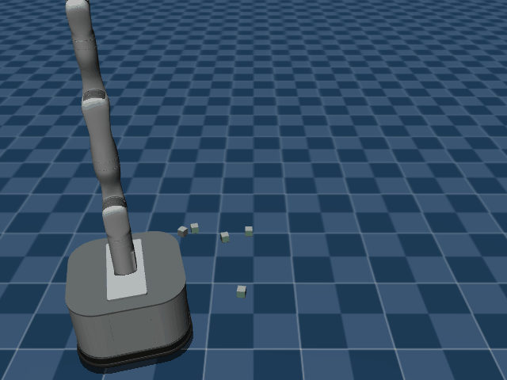
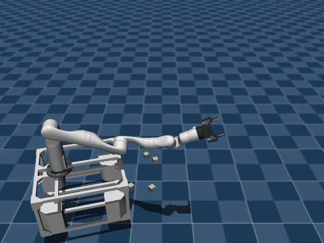

# prbench/TidyBot3D-ground-o5-v0

### Description
A 3D mobile manipulation environment using the TidyBot platform.

The robot has a holonomic mobile base with powered casters and a Kinova Gen3 arm.
Scene type: ground with 5 objects. In the 'ground' scene, objects are placed randomly on a flat ground plane.

The robot can control:
- Base pose (x, y, theta)
- Arm position (x, y, z)
- Arm orientation (quaternion)
- Gripper position (open/close)

### Initial State Distribution

### Example Demonstration
*(No demonstration GIFs available)*

### Observation Space
The entries of an array in this Box space correspond to the following object features:
| **Index** | **Object** | **Feature** |
| --- | --- | --- |
| 0 | cube1 | x |
| 1 | cube1 | y |
| 2 | cube1 | z |
| 3 | cube1 | qw |
| 4 | cube1 | qx |
| 5 | cube1 | qy |
| 6 | cube1 | qz |
| 7 | cube1 | vx |
| 8 | cube1 | vy |
| 9 | cube1 | vz |
| 10 | cube1 | wx |
| 11 | cube1 | wy |
| 12 | cube1 | wz |
| 13 | cube2 | x |
| 14 | cube2 | y |
| 15 | cube2 | z |
| 16 | cube2 | qw |
| 17 | cube2 | qx |
| 18 | cube2 | qy |
| 19 | cube2 | qz |
| 20 | cube2 | vx |
| 21 | cube2 | vy |
| 22 | cube2 | vz |
| 23 | cube2 | wx |
| 24 | cube2 | wy |
| 25 | cube2 | wz |
| 26 | cube3 | x |
| 27 | cube3 | y |
| 28 | cube3 | z |
| 29 | cube3 | qw |
| 30 | cube3 | qx |
| 31 | cube3 | qy |
| 32 | cube3 | qz |
| 33 | cube3 | vx |
| 34 | cube3 | vy |
| 35 | cube3 | vz |
| 36 | cube3 | wx |
| 37 | cube3 | wy |
| 38 | cube3 | wz |
| 39 | cube4 | x |
| 40 | cube4 | y |
| 41 | cube4 | z |
| 42 | cube4 | qw |
| 43 | cube4 | qx |
| 44 | cube4 | qy |
| 45 | cube4 | qz |
| 46 | cube4 | vx |
| 47 | cube4 | vy |
| 48 | cube4 | vz |
| 49 | cube4 | wx |
| 50 | cube4 | wy |
| 51 | cube4 | wz |
| 52 | cube5 | x |
| 53 | cube5 | y |
| 54 | cube5 | z |
| 55 | cube5 | qw |
| 56 | cube5 | qx |
| 57 | cube5 | qy |
| 58 | cube5 | qz |
| 59 | cube5 | vx |
| 60 | cube5 | vy |
| 61 | cube5 | vz |
| 62 | cube5 | wx |
| 63 | cube5 | wy |
| 64 | cube5 | wz |
| 65 | robot | pos_base_x |
| 66 | robot | pos_base_y |
| 67 | robot | pos_base_rot |
| 68 | robot | pos_arm_joint1 |
| 69 | robot | pos_arm_joint2 |
| 70 | robot | pos_arm_joint3 |
| 71 | robot | pos_arm_joint4 |
| 72 | robot | pos_arm_joint5 |
| 73 | robot | pos_arm_joint6 |
| 74 | robot | pos_arm_joint7 |
| 75 | robot | pos_gripper |
| 76 | robot | vel_base_x |
| 77 | robot | vel_base_y |
| 78 | robot | vel_base_rot |
| 79 | robot | vel_arm_joint1 |
| 80 | robot | vel_arm_joint2 |
| 81 | robot | vel_arm_joint3 |
| 82 | robot | vel_arm_joint4 |
| 83 | robot | vel_arm_joint5 |
| 84 | robot | vel_arm_joint6 |
| 85 | robot | vel_arm_joint7 |
| 86 | robot | vel_gripper |

### Action Space
Actions: base_pose (3), arm_pos (3), arm_quat (4), gripper_pos (1)

### Rewards
The primary reward is for successfully placing objects at their target locations.
- A reward of +1.0 is given for each object placed within a 5cm tolerance of its target.
- A smaller positive reward is given for objects within a 10cm tolerance to guide the robot.
- A small negative reward (-0.01) is applied at each timestep to encourage efficiency.
The episode terminates when all objects are placed at their respective targets.

### References
TidyBot++: An Open-Source Holonomic Mobile Manipulator
for Robot Learning
- Jimmy Wu, William Chong, Robert Holmberg, Aaditya Prasad, Yihuai Gao,
  Oussama Khatib, Shuran Song, Szymon Rusinkiewicz, Jeannette Bohg
- Conference on Robot Learning (CoRL), 2024

https://github.com/tidybot2/tidybot2
