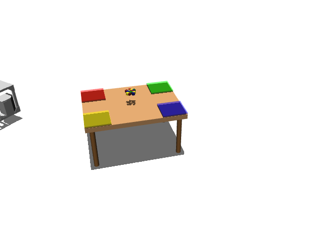

# prbench/TidyBot3D-table-o20-SortClutteredBlocks-v0

### Description
A 3D mobile manipulation environment using the TidyBot platform.

The robot has a holonomic mobile base with powered casters and a Kinova Gen3 arm.
Scene type: table with 20 objects.

The robot can control:
- Base pose (x, y, theta)
- Arm position (x, y, z)
- Arm orientation (quaternion)
- Gripper position (open/close)

### Initial State Distribution

### Example Demonstration
*(No demonstration GIFs available)*

### Observation Space
The entries of an array in this Box space correspond to the following object features:
| **Index** | **Object** | **Feature** |
| --- | --- | --- |
| 0 | cube1 | x |
| 1 | cube1 | y |
| 2 | cube1 | z |
| 3 | cube1 | qw |
| 4 | cube1 | qx |
| 5 | cube1 | qy |
| 6 | cube1 | qz |
| 7 | cube1 | vx |
| 8 | cube1 | vy |
| 9 | cube1 | vz |
| 10 | cube1 | wx |
| 11 | cube1 | wy |
| 12 | cube1 | wz |
| 13 | cube1 | bb_x |
| 14 | cube1 | bb_y |
| 15 | cube1 | bb_z |
| 16 | cube10 | x |
| 17 | cube10 | y |
| 18 | cube10 | z |
| 19 | cube10 | qw |
| 20 | cube10 | qx |
| 21 | cube10 | qy |
| 22 | cube10 | qz |
| 23 | cube10 | vx |
| 24 | cube10 | vy |
| 25 | cube10 | vz |
| 26 | cube10 | wx |
| 27 | cube10 | wy |
| 28 | cube10 | wz |
| 29 | cube10 | bb_x |
| 30 | cube10 | bb_y |
| 31 | cube10 | bb_z |
| 32 | cube11 | x |
| 33 | cube11 | y |
| 34 | cube11 | z |
| 35 | cube11 | qw |
| 36 | cube11 | qx |
| 37 | cube11 | qy |
| 38 | cube11 | qz |
| 39 | cube11 | vx |
| 40 | cube11 | vy |
| 41 | cube11 | vz |
| 42 | cube11 | wx |
| 43 | cube11 | wy |
| 44 | cube11 | wz |
| 45 | cube11 | bb_x |
| 46 | cube11 | bb_y |
| 47 | cube11 | bb_z |
| 48 | cube12 | x |
| 49 | cube12 | y |
| 50 | cube12 | z |
| 51 | cube12 | qw |
| 52 | cube12 | qx |
| 53 | cube12 | qy |
| 54 | cube12 | qz |
| 55 | cube12 | vx |
| 56 | cube12 | vy |
| 57 | cube12 | vz |
| 58 | cube12 | wx |
| 59 | cube12 | wy |
| 60 | cube12 | wz |
| 61 | cube12 | bb_x |
| 62 | cube12 | bb_y |
| 63 | cube12 | bb_z |
| 64 | cube13 | x |
| 65 | cube13 | y |
| 66 | cube13 | z |
| 67 | cube13 | qw |
| 68 | cube13 | qx |
| 69 | cube13 | qy |
| 70 | cube13 | qz |
| 71 | cube13 | vx |
| 72 | cube13 | vy |
| 73 | cube13 | vz |
| 74 | cube13 | wx |
| 75 | cube13 | wy |
| 76 | cube13 | wz |
| 77 | cube13 | bb_x |
| 78 | cube13 | bb_y |
| 79 | cube13 | bb_z |
| 80 | cube14 | x |
| 81 | cube14 | y |
| 82 | cube14 | z |
| 83 | cube14 | qw |
| 84 | cube14 | qx |
| 85 | cube14 | qy |
| 86 | cube14 | qz |
| 87 | cube14 | vx |
| 88 | cube14 | vy |
| 89 | cube14 | vz |
| 90 | cube14 | wx |
| 91 | cube14 | wy |
| 92 | cube14 | wz |
| 93 | cube14 | bb_x |
| 94 | cube14 | bb_y |
| 95 | cube14 | bb_z |
| 96 | cube15 | x |
| 97 | cube15 | y |
| 98 | cube15 | z |
| 99 | cube15 | qw |
| 100 | cube15 | qx |
| 101 | cube15 | qy |
| 102 | cube15 | qz |
| 103 | cube15 | vx |
| 104 | cube15 | vy |
| 105 | cube15 | vz |
| 106 | cube15 | wx |
| 107 | cube15 | wy |
| 108 | cube15 | wz |
| 109 | cube15 | bb_x |
| 110 | cube15 | bb_y |
| 111 | cube15 | bb_z |
| 112 | cube16 | x |
| 113 | cube16 | y |
| 114 | cube16 | z |
| 115 | cube16 | qw |
| 116 | cube16 | qx |
| 117 | cube16 | qy |
| 118 | cube16 | qz |
| 119 | cube16 | vx |
| 120 | cube16 | vy |
| 121 | cube16 | vz |
| 122 | cube16 | wx |
| 123 | cube16 | wy |
| 124 | cube16 | wz |
| 125 | cube16 | bb_x |
| 126 | cube16 | bb_y |
| 127 | cube16 | bb_z |
| 128 | cube17 | x |
| 129 | cube17 | y |
| 130 | cube17 | z |
| 131 | cube17 | qw |
| 132 | cube17 | qx |
| 133 | cube17 | qy |
| 134 | cube17 | qz |
| 135 | cube17 | vx |
| 136 | cube17 | vy |
| 137 | cube17 | vz |
| 138 | cube17 | wx |
| 139 | cube17 | wy |
| 140 | cube17 | wz |
| 141 | cube17 | bb_x |
| 142 | cube17 | bb_y |
| 143 | cube17 | bb_z |
| 144 | cube18 | x |
| 145 | cube18 | y |
| 146 | cube18 | z |
| 147 | cube18 | qw |
| 148 | cube18 | qx |
| 149 | cube18 | qy |
| 150 | cube18 | qz |
| 151 | cube18 | vx |
| 152 | cube18 | vy |
| 153 | cube18 | vz |
| 154 | cube18 | wx |
| 155 | cube18 | wy |
| 156 | cube18 | wz |
| 157 | cube18 | bb_x |
| 158 | cube18 | bb_y |
| 159 | cube18 | bb_z |
| 160 | cube19 | x |
| 161 | cube19 | y |
| 162 | cube19 | z |
| 163 | cube19 | qw |
| 164 | cube19 | qx |
| 165 | cube19 | qy |
| 166 | cube19 | qz |
| 167 | cube19 | vx |
| 168 | cube19 | vy |
| 169 | cube19 | vz |
| 170 | cube19 | wx |
| 171 | cube19 | wy |
| 172 | cube19 | wz |
| 173 | cube19 | bb_x |
| 174 | cube19 | bb_y |
| 175 | cube19 | bb_z |
| 176 | cube2 | x |
| 177 | cube2 | y |
| 178 | cube2 | z |
| 179 | cube2 | qw |
| 180 | cube2 | qx |
| 181 | cube2 | qy |
| 182 | cube2 | qz |
| 183 | cube2 | vx |
| 184 | cube2 | vy |
| 185 | cube2 | vz |
| 186 | cube2 | wx |
| 187 | cube2 | wy |
| 188 | cube2 | wz |
| 189 | cube2 | bb_x |
| 190 | cube2 | bb_y |
| 191 | cube2 | bb_z |
| 192 | cube20 | x |
| 193 | cube20 | y |
| 194 | cube20 | z |
| 195 | cube20 | qw |
| 196 | cube20 | qx |
| 197 | cube20 | qy |
| 198 | cube20 | qz |
| 199 | cube20 | vx |
| 200 | cube20 | vy |
| 201 | cube20 | vz |
| 202 | cube20 | wx |
| 203 | cube20 | wy |
| 204 | cube20 | wz |
| 205 | cube20 | bb_x |
| 206 | cube20 | bb_y |
| 207 | cube20 | bb_z |
| 208 | cube3 | x |
| 209 | cube3 | y |
| 210 | cube3 | z |
| 211 | cube3 | qw |
| 212 | cube3 | qx |
| 213 | cube3 | qy |
| 214 | cube3 | qz |
| 215 | cube3 | vx |
| 216 | cube3 | vy |
| 217 | cube3 | vz |
| 218 | cube3 | wx |
| 219 | cube3 | wy |
| 220 | cube3 | wz |
| 221 | cube3 | bb_x |
| 222 | cube3 | bb_y |
| 223 | cube3 | bb_z |
| 224 | cube4 | x |
| 225 | cube4 | y |
| 226 | cube4 | z |
| 227 | cube4 | qw |
| 228 | cube4 | qx |
| 229 | cube4 | qy |
| 230 | cube4 | qz |
| 231 | cube4 | vx |
| 232 | cube4 | vy |
| 233 | cube4 | vz |
| 234 | cube4 | wx |
| 235 | cube4 | wy |
| 236 | cube4 | wz |
| 237 | cube4 | bb_x |
| 238 | cube4 | bb_y |
| 239 | cube4 | bb_z |
| 240 | cube5 | x |
| 241 | cube5 | y |
| 242 | cube5 | z |
| 243 | cube5 | qw |
| 244 | cube5 | qx |
| 245 | cube5 | qy |
| 246 | cube5 | qz |
| 247 | cube5 | vx |
| 248 | cube5 | vy |
| 249 | cube5 | vz |
| 250 | cube5 | wx |
| 251 | cube5 | wy |
| 252 | cube5 | wz |
| 253 | cube5 | bb_x |
| 254 | cube5 | bb_y |
| 255 | cube5 | bb_z |
| 256 | cube6 | x |
| 257 | cube6 | y |
| 258 | cube6 | z |
| 259 | cube6 | qw |
| 260 | cube6 | qx |
| 261 | cube6 | qy |
| 262 | cube6 | qz |
| 263 | cube6 | vx |
| 264 | cube6 | vy |
| 265 | cube6 | vz |
| 266 | cube6 | wx |
| 267 | cube6 | wy |
| 268 | cube6 | wz |
| 269 | cube6 | bb_x |
| 270 | cube6 | bb_y |
| 271 | cube6 | bb_z |
| 272 | cube7 | x |
| 273 | cube7 | y |
| 274 | cube7 | z |
| 275 | cube7 | qw |
| 276 | cube7 | qx |
| 277 | cube7 | qy |
| 278 | cube7 | qz |
| 279 | cube7 | vx |
| 280 | cube7 | vy |
| 281 | cube7 | vz |
| 282 | cube7 | wx |
| 283 | cube7 | wy |
| 284 | cube7 | wz |
| 285 | cube7 | bb_x |
| 286 | cube7 | bb_y |
| 287 | cube7 | bb_z |
| 288 | cube8 | x |
| 289 | cube8 | y |
| 290 | cube8 | z |
| 291 | cube8 | qw |
| 292 | cube8 | qx |
| 293 | cube8 | qy |
| 294 | cube8 | qz |
| 295 | cube8 | vx |
| 296 | cube8 | vy |
| 297 | cube8 | vz |
| 298 | cube8 | wx |
| 299 | cube8 | wy |
| 300 | cube8 | wz |
| 301 | cube8 | bb_x |
| 302 | cube8 | bb_y |
| 303 | cube8 | bb_z |
| 304 | cube9 | x |
| 305 | cube9 | y |
| 306 | cube9 | z |
| 307 | cube9 | qw |
| 308 | cube9 | qx |
| 309 | cube9 | qy |
| 310 | cube9 | qz |
| 311 | cube9 | vx |
| 312 | cube9 | vy |
| 313 | cube9 | vz |
| 314 | cube9 | wx |
| 315 | cube9 | wy |
| 316 | cube9 | wz |
| 317 | cube9 | bb_x |
| 318 | cube9 | bb_y |
| 319 | cube9 | bb_z |
| 320 | robot | pos_base_x |
| 321 | robot | pos_base_y |
| 322 | robot | pos_base_rot |
| 323 | robot | pos_arm_joint1 |
| 324 | robot | pos_arm_joint2 |
| 325 | robot | pos_arm_joint3 |
| 326 | robot | pos_arm_joint4 |
| 327 | robot | pos_arm_joint5 |
| 328 | robot | pos_arm_joint6 |
| 329 | robot | pos_arm_joint7 |
| 330 | robot | pos_gripper |
| 331 | robot | vel_base_x |
| 332 | robot | vel_base_y |
| 333 | robot | vel_base_rot |
| 334 | robot | vel_arm_joint1 |
| 335 | robot | vel_arm_joint2 |
| 336 | robot | vel_arm_joint3 |
| 337 | robot | vel_arm_joint4 |
| 338 | robot | vel_arm_joint5 |
| 339 | robot | vel_arm_joint6 |
| 340 | robot | vel_arm_joint7 |
| 341 | robot | vel_gripper |
| 342 | table_1 | x |
| 343 | table_1 | y |
| 344 | table_1 | z |
| 345 | table_1 | qw |
| 346 | table_1 | qx |
| 347 | table_1 | qy |
| 348 | table_1 | qz |

### Action Space
Actions: base pos and yaw (3), arm joints (7), gripper pos (1)

### Rewards
Reward function depends on the specific task:
- Object stacking: Reward for successfully stacking objects
- Drawer/cabinet tasks: Reward for opening/closing and placing objects
- General manipulation: Reward for successful pick-and-place operations

Currently returns a small negative reward (-0.01) per timestep to encourage exploration.

### References
TidyBot++: An Open-Source Holonomic Mobile Manipulator
for Robot Learning
- Jimmy Wu, William Chong, Robert Holmberg, Aaditya Prasad, Yihuai Gao,
  Oussama Khatib, Shuran Song, Szymon Rusinkiewicz, Jeannette Bohg
- Conference on Robot Learning (CoRL), 2024

https://github.com/tidybot2/tidybot2
