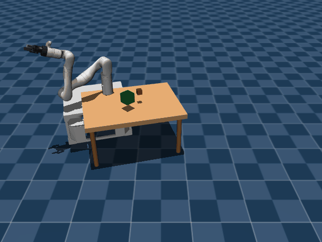

# prbench/TidyBot3D-table-o5-v0

### Description
A 3D mobile manipulation environment using the TidyBot platform.

The robot has a holonomic mobile base with powered casters and a Kinova Gen3 arm.
Scene type: table with 5 objects.

The robot can control:
- Base pose (x, y, theta)
- Arm position (x, y, z)
- Arm orientation (quaternion)
- Gripper position (open/close)

### Initial State Distribution

### Example Demonstration
*(No demonstration GIFs available)*

### Observation Space
The entries of an array in this Box space correspond to the following object features:
| **Index** | **Object** | **Feature** |
| --- | --- | --- |
| 0 | cube1 | x |
| 1 | cube1 | y |
| 2 | cube1 | z |
| 3 | cube1 | qw |
| 4 | cube1 | qx |
| 5 | cube1 | qy |
| 6 | cube1 | qz |
| 7 | cube2 | x |
| 8 | cube2 | y |
| 9 | cube2 | z |
| 10 | cube2 | qw |
| 11 | cube2 | qx |
| 12 | cube2 | qy |
| 13 | cube2 | qz |
| 14 | cube3 | x |
| 15 | cube3 | y |
| 16 | cube3 | z |
| 17 | cube3 | qw |
| 18 | cube3 | qx |
| 19 | cube3 | qy |
| 20 | cube3 | qz |
| 21 | cube4 | x |
| 22 | cube4 | y |
| 23 | cube4 | z |
| 24 | cube4 | qw |
| 25 | cube4 | qx |
| 26 | cube4 | qy |
| 27 | cube4 | qz |
| 28 | cube5 | x |
| 29 | cube5 | y |
| 30 | cube5 | z |
| 31 | cube5 | qw |
| 32 | cube5 | qx |
| 33 | cube5 | qy |
| 34 | cube5 | qz |
| 35 | robot | pos_base_x |
| 36 | robot | pos_base_y |
| 37 | robot | pos_base_rot |
| 38 | robot | pos_arm_joint1 |
| 39 | robot | pos_arm_joint2 |
| 40 | robot | pos_arm_joint3 |
| 41 | robot | pos_arm_joint4 |
| 42 | robot | pos_arm_joint5 |
| 43 | robot | pos_arm_joint6 |
| 44 | robot | pos_arm_joint7 |
| 45 | robot | pos_gripper |
| 46 | robot | vel_base_x |
| 47 | robot | vel_base_y |
| 48 | robot | vel_base_rot |
| 49 | robot | vel_arm_joint1 |
| 50 | robot | vel_arm_joint2 |
| 51 | robot | vel_arm_joint3 |
| 52 | robot | vel_arm_joint4 |
| 53 | robot | vel_arm_joint5 |
| 54 | robot | vel_arm_joint6 |
| 55 | robot | vel_arm_joint7 |
| 56 | robot | vel_gripper |

### Action Space
Actions: base_pose (3), arm_pos (3), arm_quat (4), gripper_pos (1)

### Rewards
Reward function depends on the specific task:
- Object stacking: Reward for successfully stacking objects
- Drawer/cabinet tasks: Reward for opening/closing and placing objects
- General manipulation: Reward for successful pick-and-place operations

Currently returns a small negative reward (-0.01) per timestep to encourage exploration.

### References
TidyBot++: An Open-Source Holonomic Mobile Manipulator
for Robot Learning
- Jimmy Wu, William Chong, Robert Holmberg, Aaditya Prasad, Yihuai Gao,
  Oussama Khatib, Shuran Song, Szymon Rusinkiewicz, Jeannette Bohg
- Conference on Robot Learning (CoRL), 2024

https://github.com/tidybot2/tidybot2
